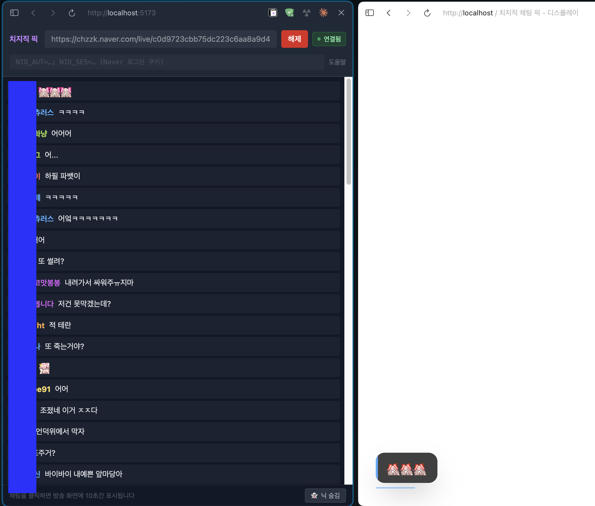

# 치지직 채팅 픽 UI

치지직(Naver 라이브) 채팅을 실시간으로 보면서 원하는 채팅을 클릭하면 OBS 브라우저 소스에 10초간 표시되는 오버레이 툴입니다.



## 화면 구성

| 페이지 | URL | 용도 |
|--------|-----|------|
| 관리자 | `http://localhost:5173/` | 채팅 목록 보기 + 클릭으로 선택 |
| 디스플레이 | `http://localhost:5173/display.html` | OBS 브라우저 소스로 추가 |

## 시작하기

### 설치

```bash
npm install
```

### 개발 서버 실행

```bash
npm run dev
```

Vite 클라이언트(포트 5173)와 Socket.io 서버(포트 3001)가 동시에 실행됩니다.

### 프로덕션 빌드 & 실행

```bash
npm run build
npm start
```

## 사용 방법

### 1. 채널 연결

관리자 페이지 상단 입력창에 치지직 채널 URL 또는 채널 ID를 붙여넣고 **연결** 버튼을 누릅니다.

```
https://chzzk.naver.com/live/c0d9723cbb75dc223c6aa8a9d4f56002
                              ^^^^^^^^^^^^^^^^^^^^^^^^^^^^^^^^
                              이 32자리 hex 값이 채널 ID
```

> 방송 중인 채널만 연결 가능합니다.

### 2. 채팅 선택 (픽)

채팅 목록에서 원하는 채팅을 클릭하면 디스플레이 화면에 10초간 표시됩니다.

### 3. 닉네임 표시 토글

하단 `👤 닉 표시 중` 버튼으로 디스플레이의 닉네임 표시 여부를 실시간으로 전환할 수 있습니다. 관리자 화면의 채팅 목록은 영향 없이 항상 닉네임이 표시됩니다.

### 4. OBS 브라우저 소스 설정

1. OBS에서 **소스 추가 → 브라우저** 선택
2. URL: `http://localhost:5173/display.html`
3. 너비: `1920`, 높이: `1080`
4. **사용자 지정 CSS** 칸에 아래 내용 입력:
   ```css
   body { background: transparent !important; }
   ```

## 성인 채널 / 로그인 필요 채널

일반 공개 채널은 쿠키 없이 연결됩니다. 성인 인증이 필요한 채널은 Naver 로그인 쿠키를 입력해야 합니다.

관리자 페이지 쿠키 입력창 옆 **도움말** 버튼을 눌러 가이드를 확인하세요.

```
NID_AUT=xxxxx; NID_SES=yyyyy
```

입력한 쿠키는 브라우저 `localStorage`에 저장되어 다음 실행 시 자동으로 불러옵니다.

## 프로젝트 구조

```
ChzzkChat_PickUI/
├── server/
│   ├── index.ts          # Express + Socket.io 서버
│   └── chzzkClient.ts    # 치지직 WebSocket 클라이언트 (직접 구현)
├── src/
│   ├── shared/
│   │   ├── types.ts          # 공유 TypeScript 타입
│   │   ├── socket.ts         # Socket.io 클라이언트 싱글톤
│   │   └── MessageContent.tsx # 이모티콘 렌더링 컴포넌트
│   ├── admin/
│   │   ├── App.tsx
│   │   └── components/
│   │       ├── ConnectForm.tsx  # 채널 연결 폼
│   │       ├── ChatList.tsx     # 채팅 목록 (자동 스크롤)
│   │       └── ChatMessage.tsx  # 채팅 행 (React.memo)
│   └── display/
│       ├── App.tsx
│       └── components/
│           └── PickedMessage.tsx # 애니메이션 채팅 버블
├── index.html            # 관리자 진입점
└── display.html          # 디스플레이 진입점 (투명 배경)
```

## Socket.io 이벤트

| 이벤트 | 방향 | 내용 |
|--------|------|------|
| `chat:connect` | 관리자 → 서버 | 채널 연결 요청 |
| `chat:disconnect` | 관리자 → 서버 | 채널 연결 해제 |
| `chat:message` | 서버 → 관리자 | 실시간 채팅 메시지 |
| `server:status` | 서버 → 전체 | 연결 상태 변경 |
| `message:pick` | 관리자 → 서버 | 채팅 선택 |
| `display:show` | 서버 → 디스플레이 | 선택된 채팅 표시 |
| `display:config` | 서버 → 디스플레이 | 닉네임 표시 설정 |

## 기술 스택

| 레이어 | 기술 |
|--------|------|
| 서버 | Node.js + TypeScript + Express + Socket.io |
| 치지직 연동 | 직접 WebSocket 구현 (`wss://kr-ss3.chat.naver.com/chat`) |
| 프론트엔드 | React 18 + TypeScript + Vite (multi-entry) |
| 스타일 | Tailwind CSS |
| 애니메이션 | Framer Motion |
